# Collaborative AI Coding Assistant: Collaborate with your Friends on the project and code Together

Register User
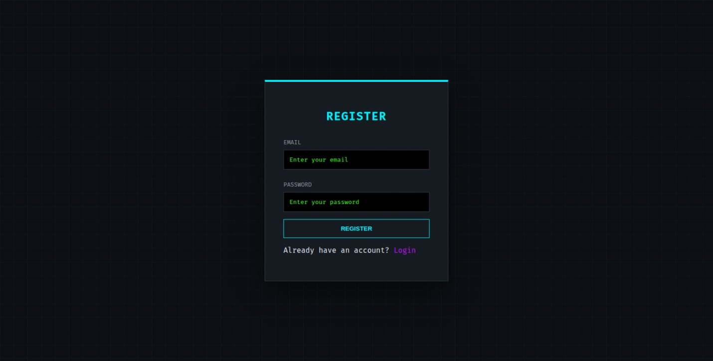
Details filled
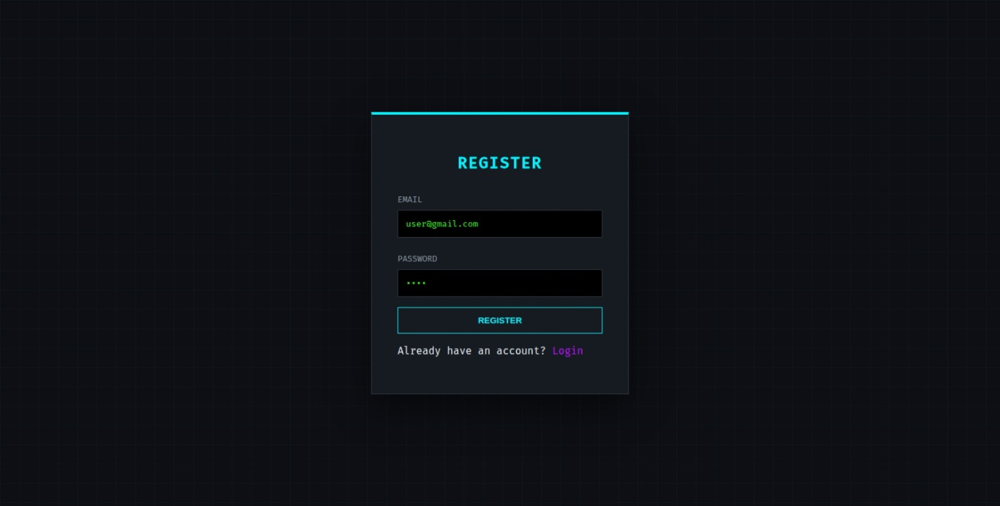
invalid user details
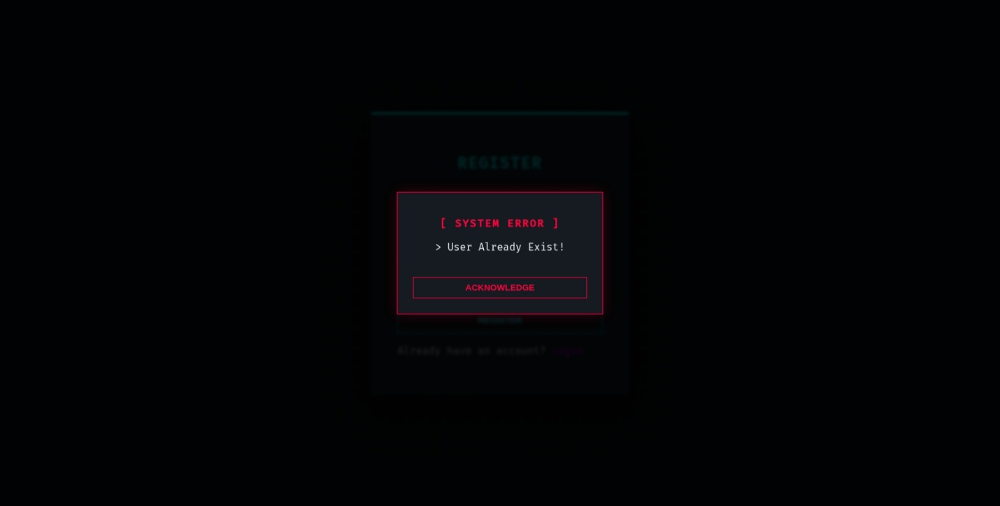
User Login
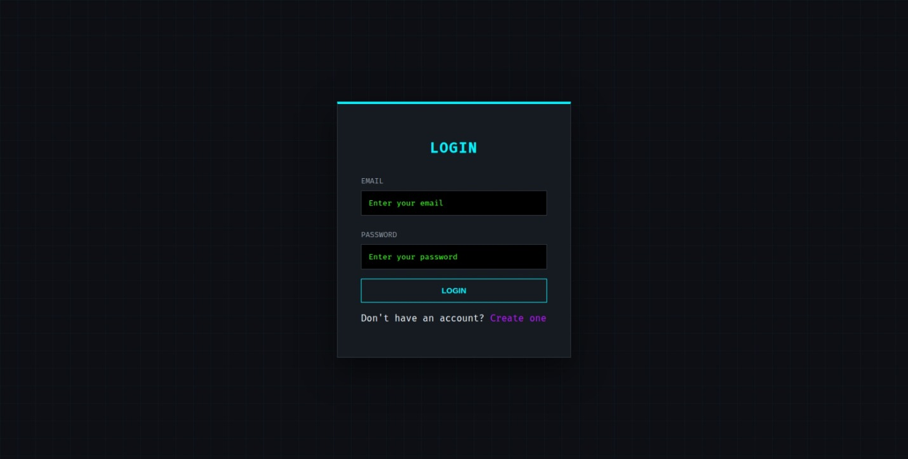
User Loged-in
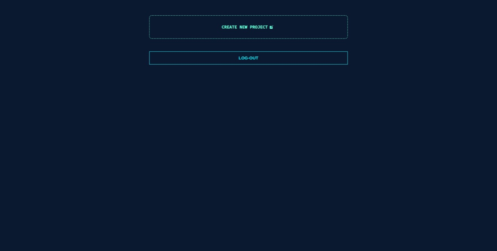
Create project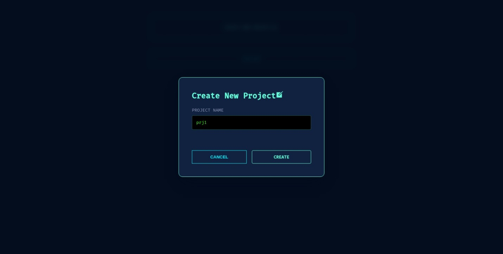!
Redirected to Project Page
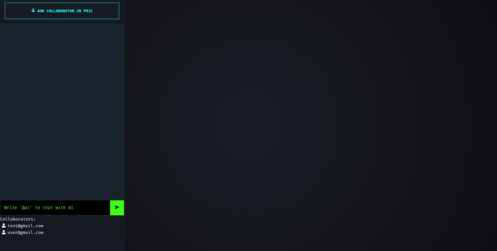
Add more collaborators
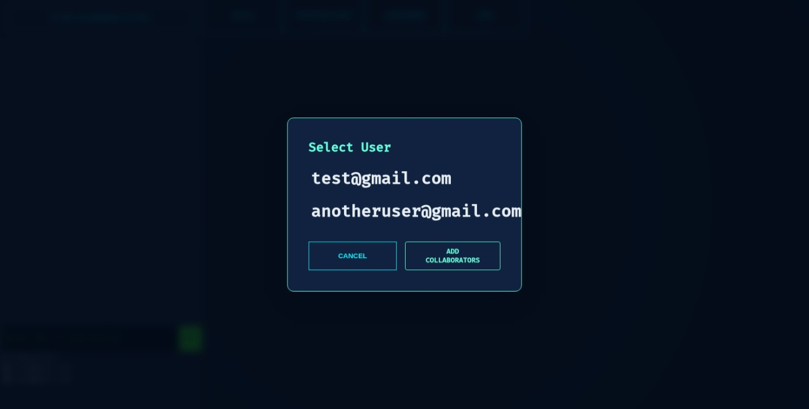
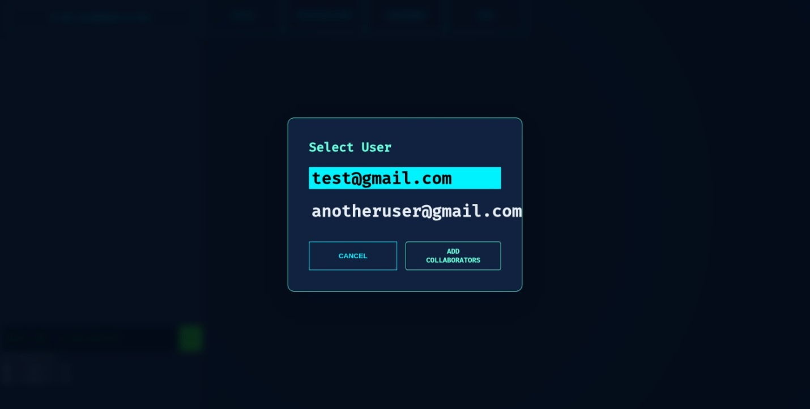
Collaborator added

Chats with Collaborator and AI
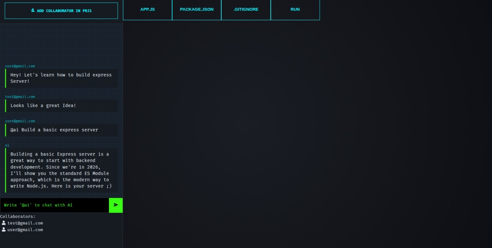
AI responded and code Generated and Runing
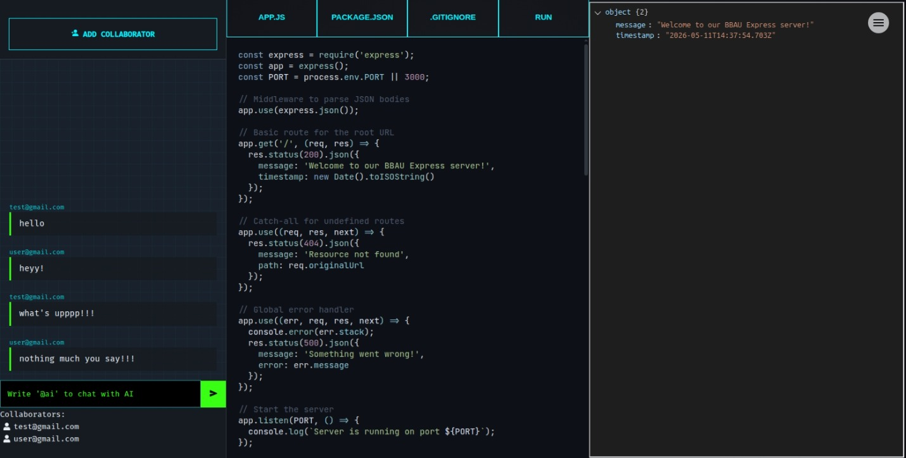

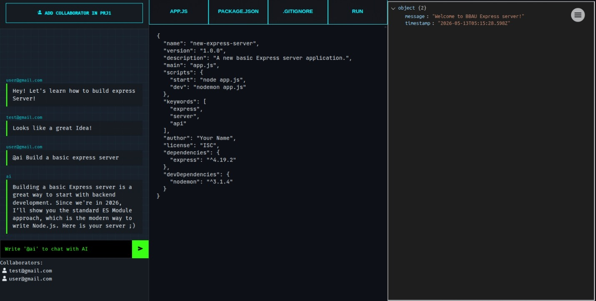

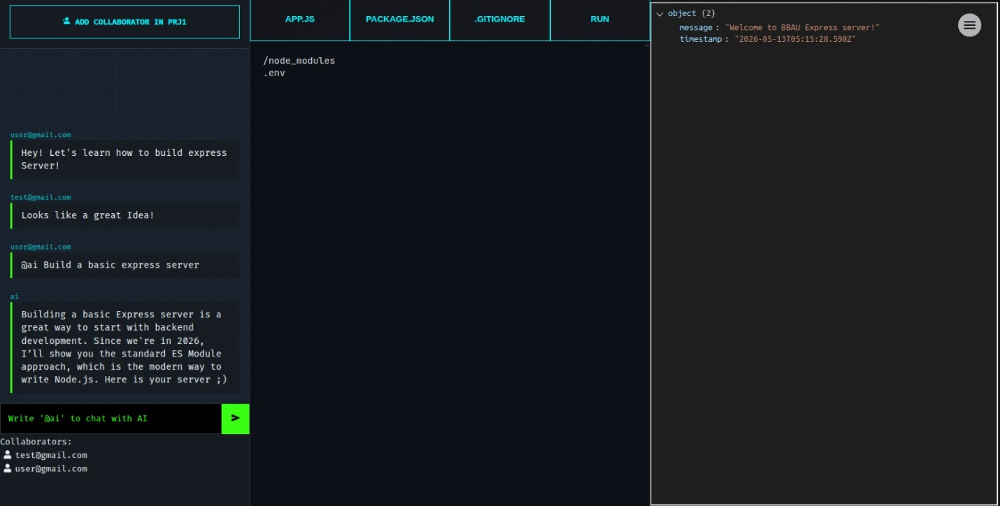
